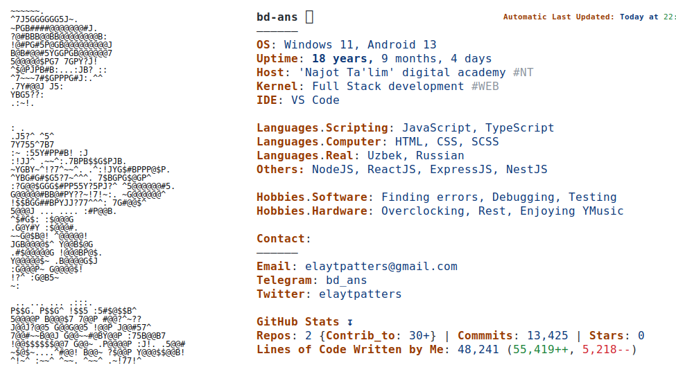

 <picture>
    <source media="(prefers-color-scheme: dark)" srcset="./imgs/dark.svg">
    
  </picture>

![github contribution grid snake animation][def]

[def]: https://raw.githubusercontent.com/bd-ans/bd-ans/output/github-contribution-grid-snake-dark.svg#gh-dark-mode-only

<h6 align="right">
  last updated: 13, 09:30
</h6>